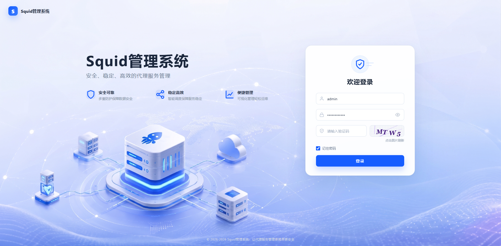
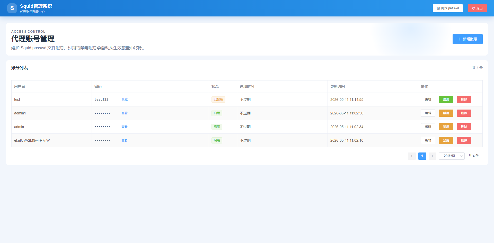

# Squid管理系统

一个 Python 3.11 + FastAPI + SQLite 的 Squid 代理账号管理后台。

## 功能

- 管理员登录，账号密码从 `.env` 读取。
- 所有接口默认必须登录，只有 `/health`、登录页、登录接口和静态资源免登录。
- 代理账号分页列表、创建、编辑、修改密码、启用/禁用、删除。
- 数据库保存代理账号明文密码，页面支持查看密码。
- 账号可设置本地时间过期时间。
- 后台任务每分钟扫描过期账号，把账号改为禁用并标记已过期。
- 自动生成 Squid htpasswd 兼容 passwd 文件；保存为禁用或过期时会立即从 passwd 文件中移除。

## 启动

```powershell
uvicorn src.app.web:app --reload
```

访问：

```text
http://127.0.0.1:8000/login
```

## Docker 部署

### squid的配套搭建教程
请看[README_SQUID.md](README_SQUID.md)

### 构建镜像

```shell
docker build -f docker/Dockerfile -t winfed/squid-manager .
```

### 启动容器
```shell
docker run -d --name squid-manager \
  -p 56688:8000 \
  -e ADMIN_USERNAME=admin \
  -e ADMIN_PASSWORD=admin@123 \
  -e SQUID_PASSWD_PATH=/app/squid/passwd \
  -v /app/docker/squid-manager/data:/app/data \
  -v /app/docker/squid:/app/squid \
  winfed/squid-manager
```

### 配置说明
`ADMIN_USERNAME` 和 `ADMIN_PASSWORD` 是管理员登录账号和密码。
`SQUID_PASSWD_PATH` 是生成给 Squid 使用的 passwd 文件路径。应用会把启用且未过期账号写入该文件。
`/app/docker/squid-manager/data` 是数据目录，保存账号信息。
`/app/docker/squid` 是 Squid 配置目录，保存 Squid 配置文件,SQUID_PASSWD_PATH的密码配置文件存储在此处。


### 访问系统
```
http://192.168.1.250:56688
admin
admin@123
```

## 系统截图

